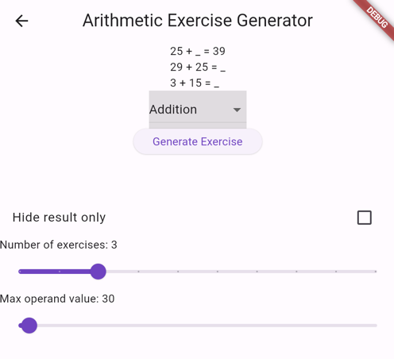
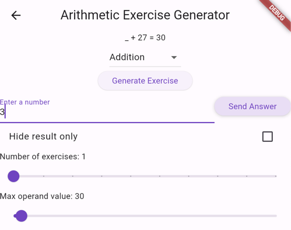
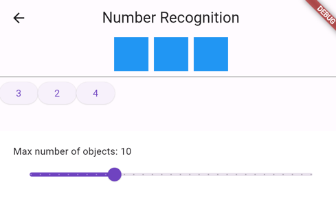

# Arithmetic Expressions Generator

A Flutter application that generates simple arithmetic expressions to use for exercising the basic arithmetic operations.

## Getting Started
To use the application, you need to have Flutter installed on your machine. 
If you don't have it, you can follow the instructions on the [Flutter website](https://flutter.dev/docs/get-started/install).

After installing Flutter, you can clone the repository and run the application on your device or emulator.

## Screenshots
### Main menu

### Arithmetic Expressions Generator.
Allows generating multiple expressions at once.
1. Also hides the different operands to make it more challenging.
2. Allows hiding only the result.
3. Allows changing the maximum operand value.

Provides a way to answer a generated expression in the app, only if one was generated.

### Number Recognition
Allows recognizing numbers by counting a random number of objects.

